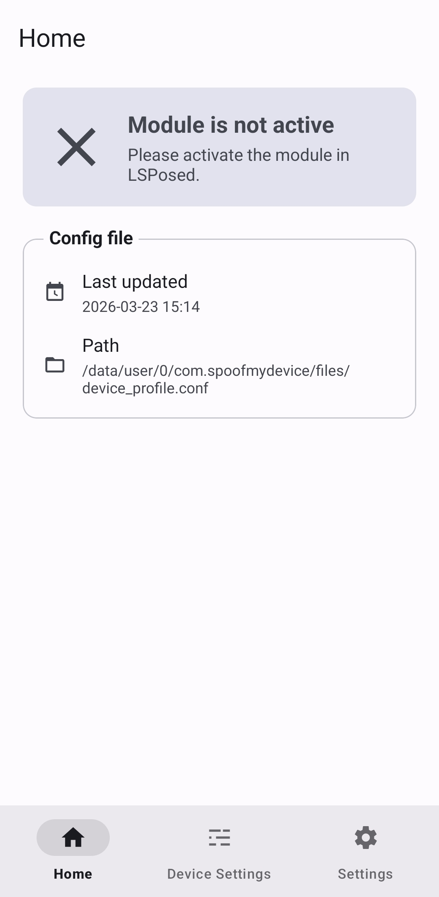
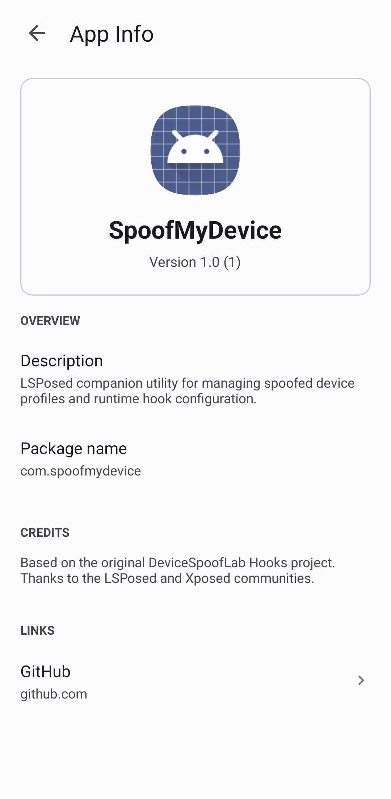

# SpoofMyDevice

SpoofMyDevice is an LSPosed / Xposed module for Android device spoofing. It lets you change the device model, brand, fingerprint, system properties, telephony values, and optional display metrics that selected apps can see.

If you need an Android spoofing module for LSPosed, device profile switching, build fingerprint spoofing, or per-app device identity testing, SpoofMyDevice is built for that workflow.

## Screenshots

## Features

- LSPosed companion app with a clean Material 3 interface
- Built-in device presets for Pixel, Galaxy, Xiaomi, tablets, and more
- Custom profile editing with preset-based starting values
- Spoofed `Build.*` fields, system properties, telephony data, and WebView user agent
- Optional spoofed display resolution and density
- Per-app behavior through LSPosed scope

## Requirements

- Android 8.0 or higher
- Rooted device
- LSPosed installed and active

## How To Use

1. Install the APK.
2. Enable the module in LSPosed.
3. Add target apps to scope.
4. Open SpoofMyDevice and pick a preset or custom profile.
5. Save the profile and restart the target app.

## Package

- App package: `com.spoofmydevice`

## Source

- Main project: https://github.com/BuSung-dev/SpoofMyDevice
